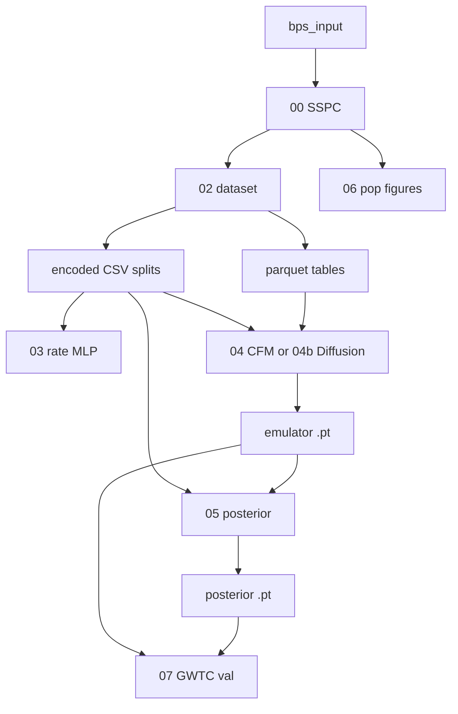

# PLANT GW Paleontology

This repository is a **software pipeline** that helps scientists ask: *When pairs of black holes (or similar compact objects) merge, what can we say about the astrophysical “settings” of the universe that most likely produced them?* The pipeline uses **simulated** mergers and **machine learning** so that, once trained, a computer can answer that kind of question quickly instead of re-running huge simulations every time.

---

## Who this document is for

- **If you are new to the project** and not from a physics or machine-learning background: start with [The big picture (plain language)](#the-big-picture-plain-language) and the [Tiny glossary](#tiny-glossary). Then skim the **In plain English** boxes under each numbered step. You do not need to read file formats or acronyms in depth to follow the *story* of the pipeline.
- **If you will run the code** on a laptop or a cluster: use [Local quick-start](#local-quick-start) and [Running on ACCESS Expanse (SLURM)](#running-on-access-expanse-slurm), then the **command-line** parts of each step.
- **If you are implementing or extending models**: read the same steps, but focus on **Inputs**, **Outputs**, and the detailed bullets (those sections stay technical on purpose).

---

## The big picture (plain language)

**What is a “gravitational wave”?** In rough terms, when very heavy dead stars (black holes) spiral together and merge, they disturb space and time. Instruments on Earth (such as LIGO) can sometimes detect a faint signal—a “gravitational wave”—from a merger.

**What is a “catalog”?** After processing detector data, each candidate merger is summarized by a few numbers you can think of as a **fingerprint**: how massive the system was, how “lopsided” the masses were, how fast it was spinning, and roughly how far away (often expressed using redshift, a stand-in for distance in cosmology). A **catalog** is a list of many such merger summaries.

**What is this pipeline trying to learn?** Astrophysicists have **knobs** that control computer models of how stars are born, evolve, and eventually merge: for example, how many stars form over cosmic time, or how the chemistry of the gas changes with distance. The pipeline’s job is to connect:

1. **Those knobs (hyperparameters / “settings”)**  
2. **To the kinds of merger fingerprints** you would expect to see in a population.

**Why is machine learning here?** A realistic simulation can be extremely slow. The pipeline first **trains a fast “fake universe” (the CFM or diffusion)**, then **trains a fast “inverse” map** (the posterior) **on the fake data that generator would produce**—so at runtime you are not re-running 00 or 04, only small neural nets. Step 3 still **predicts rates**; the “inverse” part is explicitly **chained after** the generator, not an optional parallel track.

**What is “paleontology” doing in the name?** It is a metaphor: like digging up bones and inferring the past, the project is about **inferring the history and physics of stellar populations** from the “fossil record” of mergers, using models and data together.

### Tiny glossary

| Term  | Meaning in this project |
|--------------|-----------------------------------------------|
| **Binary / merger** | Two compact objects (e.g. black holes) orbit and eventually combine; we call that a *merger*. |
| **Hyperparameters (“settings”)** | Numbers that define the astrophysical model: star-formation and metallicity recipe, and related nuisance parameters (see the tables in Step 00). |
| **SSPC** | A particular way in this project to build **synthetic** merger populations by folding stellar-population models over cosmic time (see Step 00). |
| **Intrinsic vs detection-weighted** | *Intrinsic* = full merger distribution weighted by the physical **merger rate** (no LIGO selection). *Detection-weighted* = an optional alternate view (e.g. Zenodo) where columns may include `pdet`; **this pipeline’s main SSPC path trains on the intrinsic view only.** |
| **Emulator (Step 04 *or* 04b)** | A **required** fast **surrogate** (you train one architecture): “given Λ, draw merger-like **fingerprints**.” Step 05 is trained on **batches of those draws** (emulator **frozen**), not on a separate re-read of the 02 parquets. |
| **Posterior / inverse model (Step 05)** | “**Given a bag of events**, what Λ is plausible?”—trained to invert the *emulator’s* forward map, in line with the proposal’s **Stage 2 → Stage 4** order (CFM or diffusion first, then transformer + flow). |
| **Neural network / “MLP”** | A flexible function approximator; here used for regression, generation, and inverse inference. |
| **Parquet, HDF5, JSON** | Just **file containers** for tables or hierarchical data; you can ignore the format as long as the scripts that expect them are run in order. |
| **SLURM, `sbatch`, cluster** | A **job scheduler** on high-performance computers: you submit a script, and the cluster runs it when resources are free. |
| **GPU vs CPU** | A **GPU** can accelerate certain large matrix operations (typical in deep learning). **CPU** is fine for smaller tests. |

### One-sentence summary of the technical stack (for specialists)

**Technical:** end-to-end SSPC **population** pipeline: MLP for per-grid **intrinsic merger-rate** totals; a **required** generative **emulator** (train **either** the CFM in Step 04 **or** the diffusion in Step 04b) for *p*(observables | Λ) under the same intrinsic sampling as 02; then a **set-transformer + flow** **amortized posterior** in Step 05 for *p*(Λ | catalog), where training catalogs are **synthetic samples from that emulator** (frozen), matching the proposal’s generative-then-inference ordering—not parallel shortcuts.

---

## Running on ACCESS Expanse (SLURM)

[ACCESS Expanse](https://www.sdsc.edu/services/hpc/expanse/) is a **shared research supercomputer** at SDSC. **SLURM** is the software that decides *when* and *on which computer nodes* your job runs. The commands like `sbatch` below are simply **“please run this script on the cluster when you can, using the time limits and memory I asked for.”** You do not need to know SLURM details if you are only following the *meaning* of the pipeline above—this section is for people who will actually press “submit job.”

### One-time setup on Expanse

**Python version:** this project needs **Python 3.10 or newer** (because `torchcfm` pins `pandas>=2.2.2` and modern `torch`). The login node’s default `python3` is often **3.6**; that leads to `pip` downloading ancient `torch` wheels and a **ResolutionImpossible** conflict with `torchcfm`. Run `module avail python` and load a **3.10+** module before creating the venv.

```bash
ssh <user>@login.expanse.sdsc.edu
cd /expanse/lustre/scratch/$USER/temp_project
git clone <repo> PLANT_GW_Paleontology && cd PLANT_GW_Paleontology

module purge
module load cpu    # or gpu — follow site guidance
module load python/default  # if offered; otherwise e.g. module load python/3.11.5

python3 --version   # must show 3.10.x or newer

python3 -m venv .venv && source .venv/bin/activate
pip install -U pip setuptools wheel

# Recommended on GPU nodes: install PyTorch with CUDA first (pick cu121 vs cu124 from pytorch.org for your stack)
pip install "torch>=2.1,<2.6" torchvision --index-url https://download.pytorch.org/whl/cu121

# Remaining deps (torch line in requirements.txt will usually be satisfied already)
pip install -r requirements.txt

# Optional SBI stack only if you need it
# pip install -r requirements-optional.txt

mkdir -p logs
```

If you only train on **CPU** in this venv, you can use `pip install "torch>=2.1,<2.6" torchvision --index-url https://download.pytorch.org/whl/cpu` instead of the CUDA URL, then `pip install -r requirements.txt`.

Edit `slurm/*.sh` and replace `<<PROJECT>>` with your ACCESS allocation ID (find it with `expanse-client user`). Ensure batch scripts `module load` the **same** Python you used for the venv, or use a venv built with the cluster’s intended interpreter.

### Full pipeline execution (in order)

The SLURM scripts under `slurm/` are written for **production** settings: Step **03** uses a long CPU run (`--epochs 2000`), Steps **04** / **05** use **full** GPU training (see `slurm/04_cfm.sh`, `slurm/05_posterior_network.sh`). Run from the `PLANT_GW_Paleontology/` directory after `module load` + venv activation inside each script.

**Core pipeline (00 → 05)**

```bash
# Step 00 — SSPC data generation (CPU, shared)
sbatch slurm/00_data_gen.sh

# Step 02 — build dataset (CPU; run after 00 finishes and data/sspc/models_sspc.hdf5 exists)
sbatch slurm/02_build_dataset.sh

# Step 03 — rate network, full training budget on CPU
sbatch slurm/03_rate_network.sh

# Step 04 or 04b — generative emulator on GPU (need one checkpoint before Step 05)
sbatch slurm/04_cfm.sh
# sbatch slurm/04b_diffusion.sh   # only if Step 05 will use --emulator diffusion (edit 05 script accordingly)

# Step 05 — posterior network, FullPosteriorNet on GPU (after cfm_final.pt or diffusion_final.pt exists)
sbatch slurm/05_posterior_network.sh
```

**After Step 05 — analysis, validation, and figures (CPU unless you change scripts)**

These use the **same** full checkpoints produced above (e.g. `checkpoints/cfm_final.pt`, `checkpoints/posterior_network_best.pt`). Order is flexible except: **02b** needs Step **02** artifacts; **06** / **06a** need `data/sspc/models_sspc.hdf5`; **07** needs trained **04 + 05** and a GWTC-style CSV.

```bash
# Intrinsic data QA on full parquets (after 02)
sbatch slurm/02b_data_validation.sh

# Figure 5–style distribution panels + merger-rate vs z (optional TNG paths in script / CLI)
sbatch slurm/06a_distribution_analysis.sh

# Post-training population figures from SSPC HDF5 (rate-weight vs z, M1/M2/q slices)
sbatch slurm/06_population_figures.sh

# GWTC-style catalog → posterior marginals (--model full in the SLURM script)
export EVENTS_CSV=/path/on/expanse/to/gwtc_events.csv   # or rely on data/gwtc_sample_events.csv if present
sbatch slurm/07_gwtc_validate.sh
```

**Optional — K-member epistemic ensemble (full CFM + full posterior per array index)**

Edit `#SBATCH --array=1-3` to `1-K`. Launch **05** ensemble only after the matching **04** ensemble jobs succeed.

```bash
sbatch slurm/04_cfm_ensemble.sh
# Capture job id, then e.g.:
# sbatch --dependency=afterok:<CFM_ENSEMBLE_JOBID> slurm/05_posterior_ensemble.sh
sbatch slurm/05_posterior_ensemble.sh
```

**Optional — chained dependencies (same order, fewer manual waits)**

```bash
J00=$(sbatch --parsable slurm/00_data_gen.sh)
J02=$(sbatch --parsable --dependency=afterok:${J00} slurm/02_build_dataset.sh)
J03=$(sbatch --parsable --dependency=afterok:${J02} slurm/03_rate_network.sh)
J04=$(sbatch --parsable --dependency=afterok:${J02} slurm/04_cfm.sh)
J05=$(sbatch --parsable --dependency=afterok:${J04} slurm/05_posterior_network.sh)
J02b=$(sbatch --parsable --dependency=afterok:${J02} slurm/02b_data_validation.sh)
J06a=$(sbatch --parsable --dependency=afterok:${J00}+${J02} slurm/06a_distribution_analysis.sh)
J06=$(sbatch --parsable --dependency=afterok:${J00} slurm/06_population_figures.sh)
J07=$(sbatch --parsable --dependency=afterok:${J05} slurm/07_gwtc_validate.sh)
```

(Adjust dependencies if you use **04b** instead of **04**, or if **06a** needs paths that exist only after **00**.)

**Optional:** `sbatch slurm/smoke_test.sh` — short GPU sanity pass; not a substitute for the full jobs above.

Use `squeue -u $USER` to monitor jobs. Logs go to `logs/`.

### Resource summary

| Step | Script | Partition | CPUs | GPUs | Memory | Est. Wall-time |
|------|--------|-----------|------|------|--------|----------------|
| 00 | Data generation | shared | 16 | — | 64 GB | 4 h |
| 02 | Build dataset | shared | 8 | — | 32 GB | 1 h |
| 03 | Rate network | shared | 4 | — | 16 GB | 1 h |
| 04 | CFM emulator | gpu-shared | 10 | 1×V100 | 96 GB | 24 h |
| 04b | Diffusion emulator | gpu-shared | 10 | 1×V100 | 96 GB | 24 h |
| 05 | Posterior network | gpu (see script) | 8 | 1×GPU | 64 GB | 6–24 h |
| 04 (ens.) | CFM ensemble member | gpu-shared | 10 | 1×V100 | 96 GB | 24 h (×K) |
| 05 (ens.) | Posterior ensemble | gpu | 8 | 1×GPU | 64 GB | 6–24 h (×K) |
| 06a | Distribution analysis | shared | 4 | — | 32 GB | 8 h |
| 02b | Data validation (full) | shared | 4 | — | 64 GB | 4 h |
| 06 | Population figures | shared | 4 | — | 32 GB | 4 h |
| 07 | GWTC validate | shared | 4 | — | 16 GB | 2 h |

All GPU jobs use `gpu-shared` (not exclusive), saving allocation.

Step 05: `slurm/05_posterior_network.sh` uses the **full** model on GPU; the **lite** model can be trained on CPU for debugging (see [Step 05 — Posterior network](#step-05--posterior-network-05_posterior_networkpy)). Adjust partition (`gpu`, `gpu-shared`, …) to match your site.

---

## Local quick-start

**Plain language:** the lines below are **typed in a terminal** in order: they (1) create a small isolated Python install, (2) run a *tiny* version of the science steps so you can see that everything is wired, and (3) run a very small training **test** for the “inverse” network. A full research run uses larger settings and more time.

```bash
cd PLANT_GW_Paleontology
python3 -m venv .venv && source .venv/bin/activate
pip install -r requirements.txt

# Tiny smoke-test run (CPU, ~5 min)
python 00_sspc_data_generation.py --n-sfra 4 --n-mu0 4 --n-events 5000
python 02_build_dataset.py --hdf5 data/sspc/models_sspc.hdf5 --data-source sspc
python 03_rate_network.py --epochs 200
# Generative emulator (required before Step 5) — at minimum run CFM smoke (writes checkpoints/cfm_final.pt)
python 04_cfm_emulator.py --smoke-test --steps 500
# optional second emulator for comparison, not both required for Step 5 in one go:
# python 04b_diffusion_emulator.py --smoke-test --steps 500

# Posterior: trains on **synthetic catalogs** from the frozen CFM (or diffusion, see --emulator)
python 05_posterior_network.py --emulator cfm --model lite --epochs 10 --device cpu --batch-size 4 --n-max-events 32

# Smoke test for posterior modules only
python test/test_posterior_network.py

# Post-training figures and checks (SSPC HDF5 + optional GWTC-style CSV; CPU)
python 06_population_figures.py --sspc-hdf5 data/sspc/models_sspc.hdf5
python 07_gwtc_posterior_validate.py --events-csv data/gwtc_sample_events.csv --emulator cfm
python test/test_ensemble_posterior.py
```

### Local / laptop vs ACCESS Expanse (same Python entrypoint)

| Step or tool | Local / debug | Production (SLURM) |
|----------------|---------------|---------------------|
| 00 | `--n-sfra 4 --n-mu0 4 --n-events 5000` (README quick-start) | `slurm/00_data_gen.sh` |
| 02 | `python 02_build_dataset.py --hdf5 data/sspc/models_sspc.hdf5 --data-source sspc` | `slurm/02_build_dataset.sh` |
| 02b validation | `python test/validation/run_data_validation.py` | `slurm/02b_data_validation.sh` |
| 03 | `python 03_rate_network.py --epochs 200` | `slurm/03_rate_network.sh` |
| 04 | `python 04_cfm_emulator.py --smoke-test --steps 500 --device cpu` | `slurm/04_cfm.sh` |
| 04b | `python 04b_diffusion_emulator.py --smoke-test --steps 500` | `slurm/04b_diffusion.sh` |
| 04 ensemble | `bash scripts/train_cfm_ensemble.sh 3` (tune `EXTRA_ARGS`) | `slurm/04_cfm_ensemble.sh` |
| 05 | `python 05_posterior_network.py --model lite --epochs 10 --device cpu` | `slurm/05_posterior_network.sh` |
| 05 ensemble | `bash scripts/train_posterior_ensemble.sh` | `slurm/05_posterior_ensemble.sh` |
| 06a distribution | `python data_distribution_analysis.py` | `slurm/06a_distribution_analysis.sh` |
| 06 population | `python 06_population_figures.py` | `slurm/06_population_figures.sh` |
| 07 GWTC | `python 07_gwtc_posterior_validate.py --events-csv data/gwtc_sample_events.csv` | `slurm/07_gwtc_validate.sh` (set `EVENTS_CSV`) |
| Ensemble infer | `python ensemble_posterior_infer.py --synthetic-bag --member-dirs …` | Usually local; SLURM only if huge inputs |

---

## End-to-end flow (SSPC)

**In plain English:** Start from **simulated stellar binaries**, spread them across cosmic time (**00**), and turn the result into **tables and splits** (**02**). **03** regresses the **total intrinsic merger rate** in each grid cell (from `sum_weight` in 02) from the nine SSPC parameters. The **pivot** in the *PopFlow* story is **not** to jump straight from 02 to “inverse physics”: you first train a **fast generator** (**04** CFM *or* **04b** diffusion) that, given the same Λ you stored in 02, **invents synthetic merger *fingerprints*** so that, conditional on Λ, the distribution of observables **matches 02’s intrinsic** training data (`all_events`)—the **full** merger distribution, not “what LIGO would have seen.” **Then** **05** asks: *if the only data I get are bags of *those* synthetic events (the ones the generator would make), can I *recover* the Λ that I fed the generator?* The generator’s weights are **frozen**; only the “inverse” network trains here—exactly the “end-to-end *through* the generative model” design in the research proposal, without pretending 04/04b is optional. (Full proposal *Stage 3*—a separate *selection* network and PE-style noise—can be added later; this codebase matches the *emulator → posterior* spine.)



1. **00** — BPS + cosmic integration → `models_sspc.hdf5` (grid of intrinsic catalogs by channel and `(sfr_a, μ₀)` with nuisance draws).  
2. **02** — Per-cell samples + Λ encoding + **train/val/test** + `obs_normalizer` + parquets for **emulator training** (and other analyses).  
3. **03** — MLP: Λ (with channel) → log₁₀ per-grid **intrinsic** merger-rate total (`sum_weight`).  
4. **04 *or* 04b** — **Train one** (or both for comparison) **generative** model on **02’s `all_events`** (intrinsic distribution); **save** `checkpoints/cfm_final.pt` or `diffusion_final.pt` (includes `lambda_*` column list + normalizer). **Step 5 does not use the parquets directly for its training loss**—it uses **fresh draws** from this checkpoint.  
5. **05** — **Transformer + flow**; each batch, **Λ** from 02, **synthetic** events = **emulator(Λ)** (frozen, **no** gradients into the generator); NLL to recover Λ. *Proposal alignment:* synthetic catalogs come **from the same CFM (or diffusion) you trained in 04/04b**, **after** 04/04b completes—not in parallel to skip them.  
6. **06 (optional, post-train)** — **Forward** **intrinsic** figures from the SSPC HDF5 (rate–weight vs *z*, masses in *z* slices) for paper-ready definitions.  
7. **07 (optional)** — **Validate** the posterior on a **GWTC-style CSV** (masses, spin, *z*); not full PE, not a skymap.

(An optional **epistemic ensemble** trains **K** of **04+05** with distinct seeds and combines inference with `ensemble_posterior_infer.py` — it is not a new pipeline integer, just a **mode**.)

---

## Pipeline overview

**How this section is organized:** For each step you will see, in order, **(1) In plain English** — a story version; **(2) What it does (technical)** — the precise scientific / ML operations; and **(3) inputs, outputs, and commands** as needed.

### Step 00 — SSPC Data Generation (`00_sspc_data_generation.py`)

**In plain English:** Imagine a huge catalog of *possible* star systems that could exist in a galaxy, produced by a detailed stellar-evolution code (COMPAS / GROWL). This step “rolls the dice” in a very structured way: it asks how many mergers would have happened over the history of the universe under different *global* assumptions (how many stars were born over time, how “metal-rich” gas was, and a handful of *random-looking* but physically meaningful *nuisance* numbers drawn for each grid point). The **output** is a library of *synthetic* mergers: each has a few summary numbers and a *weight* saying how *important* that kind of event was in the model. This step does **not** ask “did LIGO see it?”; that comes later. Think of it as the **unfiltered universe the model believes in**.

**What it does (technical):** Performs cosmic integration of Binary Population Synthesis (BPS) output over star formation history and metallicity evolution (Madau-Dickinson / Neijssel+19 models) to produce a grid of predicted GW merger event catalogs representing the **intrinsic** population — no detection-probability weighting is applied.

**Input:**
- `data/bps_output.h5` — COMPAS/GROWL BPS simulation output (3.35M binaries) with columns: `m1`, `m2`, `t_delay`, `metallicity`, `channel` (SMT/CE/CHE).

**Output:** `data/sspc/models_sspc.hdf5` — HDF5 file with keys `/CHANNEL/sfra{NNNN}/mu0{MMMM}`.  
Each key contains a DataFrame with columns: `mchirp`, `q`, `chieff`, `z`, `weight`.

**Parameters scanned (centred on TNG100-1 best-fit values from Briel+):**

| Parameter | Symbol | Range | TNG100-1 best-fit | Grid type |
|-----------|--------|-------|-------------------|-----------|
| SFR amplitude | `sfr_a` | 0.010 – 0.030 | ≈ 0.017 | **primary axis** |
| Mean metallicity (z=0) | `mu0` | 0.010 – 0.060 | ≈ 0.025 | **primary axis** |
| SFR rising slope | `sfr_b` | 1.0 – 3.0 | ≈ 1.46 | nuisance (random draw) |
| SFR turnover redshift | `sfr_c` | 2.0 – 6.0 | ≈ 4.51 | nuisance |
| SFR falling slope | `sfr_d` | 4.0 – 8.0 | ≈ 6.21 | nuisance |
| Metallicity evo. slope | `muz` | −0.5 – 0.1 | ≈ −0.052 | nuisance |
| Metallicity log-spread | `sigma0` | 0.5 – 1.5 | ≈ 1.15 | nuisance |
| Spread redshift evo. | `sigmaz` | −0.1 – 0.1 | ≈ 0.047 | nuisance |
| Log-skew skewness | `alpha_skew` | −2.0 – 2.0 | ≈ −1.85 | nuisance |

**Grid size:** `--n-sfra` × `--n-mu0` grid points × 3 channels (SMT, CE, CHE).  
Full run: 50 × 50 × 3 = 7,500 grid points × 50,000 events ≈ 375M events total.

**Key design:**
- Events are sampled from the **intrinsic merger-rate distribution** (no pdet cut). All mergers across all redshifts z = 0.1 – 10 are included, weighted by the physical merger rate at each redshift.
- `weight` column = per-binary intrinsic merger rate [merger/yr/binary] at the drawn z.
- `z` values clipped to ≥ 0.1 to avoid log10(0) issues.
- `chieff` drawn from channel-dependent Gaussians (no spin info in BPS): CE ~ N(0, 0.10), CHE ~ N(0.25, 0.15), SMT ~ N(0.05, 0.12).

---

### Step 02 — Build ML Dataset (`02_build_dataset.py`)

**In plain English:** The huge HDF5 from Step 00 is not yet in a shape that training code can **mini-batch**. This step (a) **draws random subsamples of mergers** from the **intrinsic** population (merger-rate weights), and (optionally) a **separate** table subsampled with detection accept/reject for side analyses; (b) **remembers which universe-settings** (the nine main numbers) went with each subsample; and (c) **writes everything as ordinary tables** on disk, plus a **normalizer** so masses and redshifts are not mixed on wildly different numeric scales. It also **holds out** some settings for *validation* and *testing* so the team can’t accidentally cheat by memorizing the whole universe. A non-expert can think of it as: **“turn the scientific archive from 00 into a clean spreadsheet and train/test groups for the classifiers and generators to come.”**

**What it does (technical):** Reads the HDF5, samples events per grid point (intrinsic by default; optional detection-subsampled copy), encodes hyperparameters, writes ML-ready parquet + JSON under the **current working directory** (default `.`). **Emulator and normalizer** use the **intrinsic** table and `sum_weight` for rates—not detector-weighted paths.

**Input:** SSPC output, e.g. `data/sspc/models_sspc.hdf5` — pass `--hdf5` and `--data-source sspc` (or use `--data-source auto`).

**Outputs (typical names in `PLANT_GW_Paleontology/`):**
- `hyperparam_table.csv` — one row per `(channel, grid key)` with `chi_b` / `alpha_CE` carrying `sfr_a` / `mu0` for SSPC, `sum_weight`, `sum_pdet`, `n_systems`, etc.
- `hyperparam_table_encoded.csv` — extended table with `channel_id`, one-hot, `lambda_*`, and **`sspc_*_mean` / `sspc_*_std`** columns for the nine SSPC parameters (used by 03 and 05).
- `all_events.parquet` — intrinsic merger-rate–weighted samples (`N_SAMPLE` per grid, default 5000); columns include `mchirp`, `q`, `chieff`, `z`, `grid_idx`, `pdet`, `lambda_*`, and per-row `sspc_*` if present. **This is the default table for 04/04b** (and the source for `obs_normalizer.json`).
- `all_detected_events.parquet` — optional detection-subsampled table (`N_DET` per grid, default 2000) for legacy or diagnostic workflows; **not** used to train 03/04/04b/05 in the main pipeline.
- `splits.json` — `train` / `val` / `test` **indices** into the encoded hyperparam table (stratified by channel).
- `checkpoints/obs_normalizer.json` — per-observable mean and `std` after the same transforms as below (used by **04 and 05**).

**Observable transforms in the normalizer (computed from `all_events` rows):**  
`mchirp` → `log10(max(mchirp, 1e-3))`, then z-score; `z` → `log10(max(z, 0.1))`, then z-score; `q` and `chieff` are z-scored in physical space.

**Key flags:** `--n-sample`, `--n-det`, `--out-dir`, `--data-source sspc`.

---

### Step 03 — Rate Network (`03_rate_network.py`)

**In plain English:** A **rate** here is the **total intrinsic merger rate** in each grid cell, in log₁₀ space, for each *combo* of channel (three broad formation stories) and the **nine** astrophysical numbers—**not** “how many events LIGO would count.” This step trains a *small* neural map: **if you hand it the table row describing the settings, it outputs one scalar** summarizing how much merger *activity* that cell carries under the physical weights from 00–02. It is a **regression** problem (predict a number), and it also trains a **Gaussian process** baseline to compare against.

**What it does (technical):** Trains an MLP to predict `log10(sum_weight)` (total **intrinsic** merger rate per grid cell) from **SSPC hyperparameters** (`sum_weight` in `hyperparam_table_encoded.csv`; for Zenodo-only tables without that column, the code can fall back to `sum_pdet`).

**Inputs (defaults are next to the script):** `hyperparam_table_encoded.csv`, `splits.json`. The CSV must contain the nine `sspc_*_mean` columns.

**Feature vector (12-D):** `[CE, CHE, SMT]` one-hot indicators + nine normalized SSPC means (`sfr_a` … `alpha_skew`), each min–max scaled using the training split.

**Architecture:** `RateNet`: 12 → (64, 32) with LayerNorm + GELU → 1; wrapped in `NormalizedNet` for z-scored targets.

**Target:** `log10(sum_weight)` floored at `-5` (per-grid **intrinsic** rate total; SSPC: `sum_pdet` in the table equals this by construction).

**Training:** Adam `lr=1e-3` (default in `train()`), weight decay `1e-4`, Huber loss on z-scored targets, ReduceLROnPlateau, early stopping (`--patience`, default 300), up to `--epochs` (default 3000). Also fits a GP baseline for comparison.

**Outputs:** `checkpoints/rate_network_best.pt`, `checkpoints/rate_network_config.json`, `checkpoints/gp_rate_baseline.pkl`, plots under `plots/rate_network/<timestamp>/`.

**CLI example:**

```bash
python 03_rate_network.py --epochs 2000 --patience 200 --checkpoint-dir checkpoints
```

---

### Step 04 — CFM Emulator (`04_cfm_emulator.py`)

**In plain English:** Instead of *one* number like Step 03, you need a model that answers: **“Given these universe-settings, *draw me realistic-looking mergers* (mass, mass ratio, spin, distance proxy).”** *Conditional flow matching* learns a **smooth transformation** from simple random noise to event data—**conditioned** on Λ. This is the **Stage-2 “emulator”** in the PopFlow proposal: **Step 05 is not an optional add-on**—it is trained **on catalogs produced by this model (or by 04b)** with the emulator **frozen**, so you must complete **04 (or 04b) before 05**.

**What it does (technical):** Trains a Conditional Flow Matching (CFM) model to learn the conditional distribution `p(mchirp, q, chieff, z | λ)` of GW event observables given hyperparameters.

**Input:** `all_events.parquet`, `checkpoints/obs_normalizer.json` (ideally from the same 02 run), `hyperparam_table_encoded.csv`, `splits.json` (resolved from the working directory the same way as 05)

**Architecture (typical):**
- Conditioning encoder: all `lambda_*` columns in `hyperparam_table_encoded.csv` (SSPC: extended vector including SSPC means) → MLP → context (128D).
- Vector field: [obs(4) + context(128) + t(1)] → [512, 512, 512, 512] → 4D (full run).
- Smoke test: `hidden_dim=128`; full training: `hidden_dim=256`.

**Training (full run):** 100,000 steps, batch=256, AdamW lr=1e-4, CosineAnnealingLR, importance-weighted sampling (cap 3.0), gradient clipping (max_norm=1.0).

**Z-jitter:** ±0.05 uniform noise added to discrete `z` values during training to smooth the distribution.

**Output:** `checkpoints/cfm_final.pt`, plots in `plots/cfm_smoke_test/<timestamp>/`.

---

### Step 04b — Diffusion Emulator (`04b_diffusion_emulator.py`)

**In plain English:** This is an **alternative** to the CFM for the **same** role: the **only** fast generator you must have **before** Step 05. You typically train **either** 04 **or** 04b, point Step 5 at `diffusion_final.pt`, and reserve running **both** for ablations. **Diffusion** denoises from noise toward data **conditioned** on Λ.

**What it does (technical):** Same task as CFM (learn `p(obs | λ)`) using a score-based diffusion model as an alternative/complement.

**Architecture:** Same encoder as CFM. Score network: [noised_obs(4) + context(128) + t_embed(32)] → [256×4] → 4D.

**Training:** Same hyperparameters as CFM (100k steps, batch=256, hidden_dim=256 for full run). Uses a cosine noise schedule with `N_TIMESTEPS=50` diffusion steps.

**Output:** `checkpoints/diffusion_final.pt`, plots in `plots/diffusion_smoke_test/<timestamp>/`.

---

### Step 05 — Posterior network (`05_posterior_network.py`)

**In plain English — what this step is for**

- **Goal:** learn a *fast* mapping from a **set of merger “fingerprints”** (a catalog) to a **distribution over the astrophysical settings** Λ—the same nine **SSPC** numbers the pipeline uses everywhere (`sspc_*_mean` in the table), while **channel** is fixed by the data row (it is not predicted in this model).
- **What “posterior” means here:** a **conditional density** *p*(Λ | catalog), not a single point estimate. The network is trained so that, when the catalog was produced from the *true* Λ for that row, the model assigns that Λ **high** log-probability, and the flow can also **draw samples** of plausible Λ for the same catalog.
- **What is *not* happening:** Step 5 does **not** train on a fixed read of `all_events.parquet` or on real detections. Every catalog in the loss is a **new synthetic draw** from the **already trained, frozen** Step 4 model (CFM or diffusion). The emulator is **read-only** here (no backprop into 04/04b), so the inverse map is explicitly the inverse of **what your emulator actually does**, not of the original HDF5 alone.
- **What one training example is:** one **row** of `hyperparam_table_encoded.csv` gives (1) the **label** Λ = nine `sspc_*_mean` values and (2) the `lambda_*` vector fed to the emulator. The emulator generates up to **`n_max_events` mergers**; each merger becomes an **8-D** feature vector. The **task** is to maximize *p*(Λ | that bag of features). The model must be insensitive to the **order** of events in the bag.
- **Amortized:** you train **once**; at use time, **one forward pass** (plus flow sampling) answers “what Λ is plausible for this catalog?” for **any** new catalog, without a separate MCMC run per case.
- **Out of scope in this script:** LIGO **selection** and per-event **parameter estimation (PE)** on strain are *not* implemented; they are natural add-ons, not part of this file.
- **How this sits in the chain:** Step **04/04b** learns a forward model *p*(events | Λ). Step **05** learns its **amortized inverse** *p*(Λ | catalog) **under the same forward process** (same frozen net, same featurization). That is why training never reads a static 02 parquet for the loss—only **fresh** emulator draws match the generator the posterior must invert at test time.

**What it does (technical)**

1. **Load** `hyperparam_table_encoded.csv`, `splits.json`, and a frozen 04/04b checkpoint containing `model_state`, `obs_normalizer`, and `lambda_cols` (names must match the table used when training 04/04b).
2. For each **batch** of table rows, the dataset calls **`generate_catalog(λ, n_max_events, model, normalizer)`** to create a **stochastic** catalog, then `build_events_8d` to tensor `(B, L, 8)` with a padding **mask** (fixed `L = n_max_events` in typical runs). The **supervised label** for the flow is the same row’s **nine** `sspc_*_mean` values, **z-scored** with mean and std from the **train split** only (buffers + JSON config). **Channel** is implicit in the row (it affects which `lambda_*` and emulator draw you get), but the nine predicted means are the Λ **vector** the flow models.
3. A **set encoder** (Transformer, no positional encodings) maps variable-length (masked) event sets to one **context vector** per row. A **conditional RealNVP** models *p*(Λ | context) with exact **log p** and **sampling** via the inverse map.
4. **Optimization** minimizes **NLL = −log *p*(Λ | catalog)** (batch-meaned), with Adam, optional gradient clipping, AMP on CUDA, and **early stopping** on **validation** NLL. **Best** validation `state_dict` is saved. Gradients do **not** flow into the emulator.

**When to run:** After **02** and after **at least one of 04 or 04b** has written `checkpoints/cfm_final.pt` or `diffusion_final.pt`. **Step 03 is not** required.

#### Inputs

| Artifact / object | Role |
|----------|------|
| `hyperparam_table_encoded.csv` | True Λ: nine `sspc_*_mean` + same `lambda_*` columns the emulator was trained on. |
| `splits.json` | Train / val / test row indices. |
| `checkpoints/cfm_final.pt` **or** `diffusion_final.pt` | **Frozen** generator; `05` reads `model_state`, `normalizer`, `lambda_cols` (must **match** the 02 table 04/04b used). **Event featurization** uses the `normalizer` **from this file** so it stays consistent with the emulator. |
| (Context) | Step 04/04b trained on **`all_events.parquet`**; Step 05 does not read that parquet for its loss (only the frozen emulator checkpoint). |

#### What each merger becomes (8-D features)

`build_events_8d` turns each emulated **(mchirp, q, chieff, z)** row into **eight** numbers: the four observables are z-scored using the **`obs_normalizer` inside the 04/04b checkpoint** (same convention as training the emulator); **four extra channels** repeat the per-dimension “σ” from that normalizer so the network sees both value and scale. The dataset builds tensors `(B, L, 8)` with a **mask** for padding. Each training **epoch** nudges the random seed (`set_epoch`) so CFM ODE or diffusion noise does not repeat identically every pass. **`--n-max-events`** sets `L` (default `256`).

**Architectures — what they are in general, and what they do here**

| Component | In general (ML) | In this project |
|-----------|------------------|-----------------|
| **Set Transformer encoder** | A Transformer that treats a **set** of items (here: events) as **unordered**: no positional encodings, and attention is masked so padding is ignored. A permutation of events should not change the output. The stack outputs one vector per event; these are **mean-pooled** (masked) to one **catalog vector**. | **Input:** `(batch, L, 8)` + mask. **Output:** a single **context** vector per catalog, dimension `H` (e.g. 128 in **lite**). This vector summarizes the whole synthetic bag *before* any decision about Λ. |
| **Conditional RealNVP (flow)** | A **normalizing flow**: a composition of **invertible** blocks so the model defines an explicit **density** and can **sample** by pushing Gaussian noise through the inverse map. *Conditional* means scale/translation in each block can depend on an external **context** vector. | **Data** for the flow are the **nine** Λ values **z-scored** with train-split statistics. **Context** = catalog embedding from the encoder. The flow parameterizes *p*(Λ \| catalog); **NLL = −log *p* at the true Λ** is the training loss. **`sample`:** draw **z** ~ 𝒩(0, **I**), then invert the flow to get a catalog-consistent Λ in physical units. |

| Variant | `LitePosteriorNet` | `FullPosteriorNet` |
|--------|---------------------|--------------------|
| Encoder layers / heads / `d_model` | 2 / 4 / 128 | 6 / 8 / 512 |
| FFN dim | 512 | 2048 |
| Flow coupling layers / MLP width | 4 / 64 | 10 / 256 |
| Typical params | ~0.5M | ~20M+ (large GPU) |
| Use case | Smaller grids, CPU or quick GPU | Large grids, long runs on a strong GPU |

**Implementation:** `models/posterior_network_lite.py` and `models/posterior_network_full.py`. Training uses Adam, optional **`--max-grad-norm`**, **`--amp`** (CUDA), and **`--accum-steps`**.

**API (both variants):** `log_prob(theta, events, event_mask)` → per-example scalar; `sample(events, event_mask, num_samples)` → `(B, num_samples, 9)` **physical** Λ; `encode_catalog` → catalog embeddings. **Buffers** `theta_mean` / `theta_std` (train split) are also stored in `posterior_network_config.json`.

#### Outputs

- `checkpoints/posterior_network_best.pt` — `state_dict` at best validation NLL.  
- `checkpoints/posterior_network_config.json` — `sspc_theta_param_cols`, `input_event_dim` (= 8), `norm_meta` (`theta_mean`, `theta_std`, and the `obs_normalizer` snapshot).  
- `plots/posterior_network/<timestamp>/learning_curves.png` — train/val NLL.

#### Command-line (run from `PLANT_GW_Paleontology/`)

```bash
# Default: --emulator cfm, load checkpoints/cfm_final.pt, lite posterior, --num-workers 0
python 05_posterior_network.py

# Use diffusion instead (must have trained 04b)
python 05_posterior_network.py --emulator diffusion --emulator-checkpoint checkpoints/diffusion_final.pt

# Full model + GPU
python 05_posterior_network.py --emulator cfm --model full --amp --device cuda \
  --batch-size 8 --n-max-events 256 --epochs 200 --patience 30

# Custom paths
python 05_posterior_network.py \
  --emulator cfm \
  --emulator-checkpoint ./checkpoints/cfm_final.pt \
  --hyperparam-csv ./hyperparam_table_encoded.csv \
  --splits-json ./splits.json \
  --checkpoint-dir ./checkpoints
```

| Flag | Default | Meaning |
|------|---------|---------|
| `--emulator` | `cfm` | `cfm` or `diffusion` — which 04/04b checkpoint to load. |
| `--emulator-checkpoint` | `checkpoints/cfm_final.pt` or `diffusion_final.pt` | Path to 04/04b **final** save (contains `model_state`, `normalizer`, `lambda_cols`). |
| `--model` | `lite` | `lite` or `full` (posterior). |
| `--epochs` | 200 | Max training epochs. |
| `--patience` | 30 | Early stopping on val NLL. |
| `--batch-size` | 8 | Catalogs per batch (keep modest—each needs ODE/diffusion samples). |
| `--lr` | 1e-4 | Adam learning rate. |
| `--n-max-events` | 256 | Emulated events per catalog per step. |
| `--max-grad-norm` | 1.0 | Gradient clip (set `0` to disable). |
| `--num-workers` | `0` (forced) | **Must** stay 0; on-the-fly generation runs in the main process. |
| `--seed` | 42 | RNG. |
| `--amp` | off | CUDA autocast. |
| `--device` | `auto` | Same device for emulator + posterior. |
| `--accum-steps` | 1 | Gradient accumulation. |
| `--output-checkpoint-pt` | (unset) | Optional explicit path for `posterior_network_best.pt` (e.g. `checkpoints/posterior_ensemble/2/…`); config JSON is written next to it. |

**Cluster:** `slurm/05_posterior_network.sh` should run **after** 04/04b completes. It passes `--emulator cfm` and `CUDA`; set `--emulator` / path if you use diffusion. For **K** ensemble members, use `slurm/05_posterior_ensemble.sh` (array job) with matching `checkpoints/ensemble_cfm/`.

**Unit test (no data required):** `python test/test_posterior_network.py` — shape checks, parameter counts, and RealNVP round-trip on synthetic tensors.

---

### Step 06 — Population / astrophysics figures (`06_population_figures.py`)

**In plain English:** After training, you may want **forward** (population) figures: how merger **rate** and **masses** look as a function of redshift in the **SSPC** library. Step 5 alone outputs Λ, not a full *dR/dz* sheet; this script **reads the intrinsic HDF5** (same as Step 00) and plots **aggregated** rate-weight vs *z* and **mass ratio** panels in *z* slices. This is a **clarity** step for papers: it keeps definitions of “rate at a z-bin” in one place.

**What it does (technical):** Reuses `load_sspc_rate_vs_redshift` and `m1_from_mchirp_q` from `data_distribution_analysis.py` to (1) plot summed SSPC `weight` vs *z* (0–10) as a **shape** proxy, with markers at reference *z* values, and (2) weighted histograms of *m*₁, *m*₂, and *q* for events within the *z* tolerance around each slice, for each **channel** (SMT, CE; optional CHE). Defaults write under `plots/population_results/<timestamp>/`.

**What the plots show**

- **`rate_vs_redshift_sspc.png`** — **Sum of merger-rate weights** in each *z* bin (aggregated from the HDF5), on a log *y* scale; a **shape** proxy, not a calibrated Gpc⁻³ yr⁻¹ unless you renormalize against cosmology. Vertical markers: requested *z* slices.
- **`rate_at_z_markers.txt`** — Numeric `sum_weight` at the *z* bin nearest each marker.
- **`channel_{SMT|CE|CHE}_zslice_*.png`** — Weighted *m*₁, *m*₂, *q* for events near the requested *z*.

**Command-line (local, CPU):**

```bash
python 06_population_figures.py --sspc-hdf5 data/sspc/models_sspc.hdf5 --z-slices 0.2 1.0
```

**Cluster:** `slurm/06_population_figures.sh` — same script, longer wall time if the HDF5 is very large (mostly I/O bound).

---

### Step 07 — GWTC-style Λ validation (`07_gwtc_posterior_validate.py`)

**In plain English:** This script takes a **small table of real (or export) event point estimates** — primary and secondary mass, effective spin, redshift — and asks the **trained** Step 5 model for **samples of the nine** `sspc_*_mean` parameters. It is **not** a skymap or a full LIGO PE; it is a **sanity check** that the inverse network behaves sensibly on numbers in the right ballpark. **Channel** (SMT/CE/CHE) is **not** an input: see `gwtc_channel_stopgap.md` in the output folder for the v1 scope.

**What it does (technical):** Maps masses → chirp mass and *q*; `build_events_8d` with the **emulator** `obs_normalizer`; `PosteriorNet.sample`. Writes marginals, `theta_summary.csv`, and `run_meta.json` under `plots/gwtc_validation/<timestamp>/` by default.

**What the plots show**

- **`marginal_thetas.png`** — 1-D histograms of each **SSPC mean** under the model (uncertainty in **inferred** settings, not in detector masses unless you add PE).

**Input CSV** (case-insensitive columns): `m1` or `mass_1`, `m2` or `mass_2`, `chi_eff` or `chieff`, `z` or `redshift`. A **mock** three-event file ships as `data/gwtc_sample_events.csv` for wiring tests.

```bash
python 07_gwtc_posterior_validate.py --events-csv data/gwtc_sample_events.csv \
  --checkpoint-dir checkpoints --emulator cfm
```

**Cluster:** `slurm/07_gwtc_validate.sh` — set `EVENTS_CSV` to your GWOSC export if not using the sample file.

---

### Optional — Epistemic ensemble (04 + 05 + `ensemble_posterior_infer.py`)

**In plain English:** You can train **K** independent emulators (different `--seed` and `--output-checkpoint`) and **K** matching posteriors, each with its own `--emulator-checkpoint` and `--output-checkpoint-pt`. **Epistemic** spread is the disagreement across these **training** runs; **aleatoric** spread is the flow’s *stochastic* samples for a **fixed** member. The helpers **do not** ensemble Step 00 or 03 unless you add that separately.

**What it does (technical):** `models/ensemble_posterior.py` implements (1) **log-mean of log-densities** (1/*K* ∑ log *p*ₖ) — the log of a **geometric mean** of member densities, useful for **point** reporting with the usual caveats about flows and normalization, and (2) **mixture sampling**: draw equally from each member and **concatenate** (labels which member a sample came from are not kept unless you extend the code). `ensemble_posterior_infer.py` can run in **`--synthetic-bag`** mode without a CSV for a quick check.

**Command-line (local, CPU, synthetic bag, needs trained checkpoints in `member-dirs`):**

```bash
python ensemble_posterior_infer.py --synthetic-bag --member-dirs checkpoints/posterior_ensemble/1 checkpoints/posterior_ensemble/2 --mode both
```

**Unit test:** `python test/test_ensemble_posterior.py` — K identical members recover the same log-density as a single model.

**Shell helpers:** `scripts/train_cfm_ensemble.sh`, `scripts/train_posterior_ensemble.sh` — see comments inside for `DEVICE` and `EXTRA_ARGS`.

**Cluster:** `slurm/04_cfm_ensemble.sh` and `slurm/05_posterior_ensemble.sh` (array jobs); adjust `#SBATCH --array=1-K`.

---

### Analysis — BBH Mass Distribution (`data_distribution_analysis.py`)

**In plain English:** A **“BBH”** (binary black hole) **mass distribution** is “how many mergers you get at each primary black-hole mass” (a histogram in physics language). This script is not part of the **training** path; it is a **figure** to **eyeball** whether the *shapes* of masses from this pipeline in the *right-hand* panels are in the **ballpark** of a modern cosmological simulation (TNG) on the *left*—*not* a statistical proof, but a **sanity check** that the synthetic pipeline is not wildly off. Redshift = “how far back in cosmic time / how far in distance” the merger effectively lived.

**What it does (technical):** Reproduces Figure 5 of Briel et al. (Fit_SFRD_TNG paper) and overplots SSPC-generated data for direct comparison. Shows the redshift evolution of the BBH primary-mass distribution dR/dm₁ across three formation channels at merger redshifts z = 0.1 – 0.5.

**Input:**
- `data/sspc/models_sspc.hdf5` — SSPC event catalogs (right column)
- `../Fit_SFRD_TNG/data/Rate_info.h5` — TNG100-1 intrinsic merger rate (left column; optional)
- `../Fit_SFRD_TNG/data/COMPAS_Output_wWeights.h5` — COMPAS DCO table (optional)
- `../Fit_SFRD_TNG/data/BBHMassSpinRedshift_BSplineIID.h5` — GWTC-4 B-Spline overlay (optional, requires `popsummary`)

**Output (default):** `plots/distribution_analysis/<timestamp>/data_distribution_analysis.png` and `merger_rate_density_redshift.png` (or override with `--output` / `--fig4-output` / `--output-dir`; use `--no-timestamped-dir` for a flat layout).

**Figure layout:**

| Row | Channel |
|-----|---------|
| 0 | All channels (stable + CE, CHE excluded — matching original Fig. 5) |
| 1 | Stable mass-transfer (SMT) only |
| 2 | Common-envelope (CE) only |

- **Left column**: TNG100-1 intrinsic rate [Gpc⁻³ yr⁻¹ M☉⁻¹] — reproduced from the reference figure
- **Right column**: SSPC intrinsic merger-rate dN/dm₁ aggregated across all grid points, area-normalised per z-slice for shape comparison
- **Merger rate vs redshift (Fig 4/6)**: the companion `merger_rate_density_redshift.png` in the same run folder (when generated) — intrinsic merger-rate **density** as a function of *z* for the SSPC run
- Gray band: GWTC-4 B-Spline posterior (from `popsummary`)
- Colors: `rocket_r` colormap, darkest = z=0.1, lightest = z=0.5

**Note on z range:** The SSPC data now spans z = 0.1 – 10 (intrinsic rate, no detection cut). TNG data in `Rate_info.h5` covers z ≤ 0.45. The original paper uses z up to 8, which requires a full TNG simulation run.

**Usage:**
```bash
python data_distribution_analysis.py

# With custom paths
python data_distribution_analysis.py \
  --tng-data-dir /path/to/Fit_SFRD_TNG/data \
  --sspc-hdf5 data/sspc/models_sspc.hdf5 \
  --output plots/my_comparison.png
```

---

### Intrinsic data validation (`test/validation/run_data_validation.py`)

**In plain English:** Before trusting months of training, the team runs a **checklist** on the *intrinsic* table from Step 02: are there *holes* in the grid, crazy numbers, or train/test *leaks*? Think of a **data-quality inspector** for scientific tables—flags weird coverage, bad splits, or distribution shifts.

**What it does (technical):** After `02_build_dataset.py`, this script checks that the **intrinsic** training data (full event range, not detection-weighted) is consistent and usable. It reads `all_events.parquet` by default and does **not** filter on detectability or use `all_detected_events.parquet` for these checks.

**Checks (summary):**

| Check | Purpose |
|-------|---------|
| **Grid coverage** | `lambda_*` ranges, CE occupancy in `(chi_b, alpha_CE)` space, optional coverage plots |
| **Channel health** | Per-channel grid counts and intrinsic `sum_weight` / `log_efficiency` from `hyperparam_table.csv` |
| **Event validity** | NaNs, physical bounds on `mchirp`, `q`, `chieff`, `z`; `weight` is optional (if absent, weight checks are skipped) |
| **Split hygiene** | No overlapping `grid_idx` across train/val/test; nearest train–test distance in λ-space |
| **Rare regions** | Flags low-intrinsic-rate grid points (default: bottom 5% of `sum_weight`) |
| **Distribution sanity** | Train vs test KL / KS / MMD on observables; redshift shape by `channel_id` |

**Outputs (default):** each run creates a **timestamped** subfolder, e.g. `test/reports/validation/<timestamp>/` and `test/plots/validation/<timestamp>/`, containing:

- `validation_summary.json` — machine-readable pass/warn/fail per check  
- `validation_summary.md` — short table  
- `*.csv` — e.g. channel summary, rare-event flags, violations sample  
- `*.png` — heatmaps, histograms, CDFs  

Use `--no-timestamp-subdir` for the legacy flat layout under `test/reports/validation/`.

**When to run:** After Step 02 (same directory as `hyperparam_table.csv`, `hyperparam_table_encoded.csv`, `splits.json`, `all_events.parquet`).

**How to run:**

```bash
cd PLANT_GW_Paleontology
source ../venv/bin/activate   # or your venv

python test/validation/run_data_validation.py
```

**Options:**

| Flag | Meaning |
|------|---------|
| `--project-root PATH` | Root directory (default: parent of `test/validation/`) |
| `--events-parquet PATH` | Override path to intrinsic events (default: `all_events.parquet` under project root) |
| `--rare-quantile FLOAT` | Quantile for “rare” intrinsic grids (default: `0.05`) |
| `--strict` | Exit with code 1 if any check is **warn** or **fail** (for CI / batch jobs) |
| `--no-timestamp-subdir` | Write reports directly under `test/reports/validation/` (no per-run subfolder) |
| `--run-id NAME` | Use `NAME` as the subfolder instead of an automatic timestamp |

---

## File structure

**Plain language:** this is a **map of filenames**—not something to memorize. The **numbered scripts** (`00`, `02`, …) are the **main story in order**; `models/` holds the **building blocks** for the neural networks; `slurm/` holds **cluster job recipes**; `data/` is where the **heavy scientific input** lives; `checkpoints/` is where **trained weights** get saved so you do not have to re-train from scratch.

```
PLANT_GW_Paleontology/
├── 00_sspc_data_generation.py   # Step 00: SSPC cosmic integration
├── 02_build_dataset.py          # Step 02: HDF5 → parquet + normalizer
├── 03_rate_network.py           # Step 03: rate MLP
├── 04_cfm_emulator.py           # Step 04: CFM emulator
├── 04b_diffusion_emulator.py    # Step 04b: Diffusion emulator
├── 05_posterior_network.py    # Step 05: amortized p(Λ|catalog) (set encoder + flow)
├── 06_population_figures.py   # Post-train: SSPC dR/dz-style + mass panels
├── 07_gwtc_posterior_validate.py  # Post-train: CSV → posterior marginals
├── ensemble_posterior_infer.py  # K posteriors: log-mean + mixture samples
├── models/
│   ├── rate_network.py
│   ├── cfm_emulator.py
│   ├── diffusion_emulator.py
│   ├── ensemble_posterior.py    # log-mean log p, mixture_sample
│   ├── posterior_network_lite.py   # LitePosteriorNet, PosteriorNet, SSPC Λ list
│   └── posterior_network_full.py  # FullPosteriorNet
├── data_distribution_analysis.py  # Figure 5 comparison (TNG vs SSPC mass dist.)
├── scripts/                     # train_cfm_ensemble.sh, train_posterior_ensemble.sh
├── selection_effects.py         # pdet computation (SNR grid; used by 02 / analysis)
├── test/
│   ├── test_posterior_network.py  # Unit tests for posterior Nets (synthetic, CPU)
│   ├── test_ensemble_posterior.py
│   ├── validation/
│   │   └── run_data_validation.py   # Intrinsic data validation (after Step 02)
│   ├── reports/validation/          # validation_summary.json, .md, CSVs (timestamped subdirs)
│   └── plots/validation/            # validation plots (timestamped subdirs)
├── requirements.txt
├── requirements-optional.txt  # e.g. sbi (not used by core pipeline scripts)
├── slurm/
│   ├── 00_data_gen.sh
│   ├── 02_build_dataset.sh
│   ├── 02b_data_validation.sh
│   ├── 03_rate_network.sh
│   ├── 04_cfm.sh
│   ├── 04b_diffusion.sh
│   ├── 04_cfm_ensemble.sh
│   ├── 05_posterior_network.sh   # GPU full-model training (tune for site)
│   ├── 05_posterior_ensemble.sh
│   ├── 06_population_figures.sh
│   ├── 06a_distribution_analysis.sh
│   ├── 07_gwtc_validate.sh
│   └── smoke_test.sh
├── data/
│   ├── bps_output.h5              # BPS input (COMPAS/GROWL)
│   └── sspc/
│       └── models_sspc.hdf5      # generated event catalogs (00)
├── checkpoints/                   # (also written in CWD when running 02/03/05)
│   ├── obs_normalizer.json       # from 02; read by 04, 05
│   ├── rate_network_best.pt
│   ├── rate_network_config.json
│   ├── gp_rate_baseline.pkl
│   ├── cfm_*.pt / diffusion_*.pt # naming depends on 04/04b training mode
│   ├── posterior_network_best.pt
│   └── posterior_network_config.json
└── plots/
    ├── rate_network/
    ├── cfm_*, diffusion_*/
    ├── posterior_network/
    ├── distribution_analysis/     # per-run timestamped (data_distribution_analysis)
    ├── population_results/         # 06
    ├── gwtc_validation/           # 07
    └── ensemble_posterior/        # ensemble_posterior_infer.py
```

---

## Notes

**In plain English:** *Why do we care about CPU vs GPU?* The **math-heavy** training (Steps 04–05 *full*) is much faster on a **GPU** (a card good at huge parallel matrix work). **Steps 00–03** are usually run on ordinary **CPU** nodes. *What is a checkpoint?* A **saved snapshot** of the learned numbers inside the neural networks so you can **stop and resume**, or **share** results with a collaborator without them re-running training.

- **CPU vs GPU:** Steps 00–03 are typically CPU. Steps 04/04b and **05** (full) are best on **GPU** (05 repeatedly calls the frozen emulator’s sampler). **Order:** finish **one** of 04/04b **before** 05; Step 05 is **not** a substitute for 04/04b.
- **Lustre constraint:** On Expanse, add `#SBATCH --constraint="lustre"` to any script if you place data on `/expanse/lustre/scratch` (Lustre is a **shared file system** tuned for large parallel reads—only relevant if your site uses it).
- **Account ID:** Replace `<<PROJECT>>` in all SLURM scripts with your actual **allocation code** (the project the supercomputer bills time to).
- **Checkpoint loading (technical):** e.g. `torch.load("checkpoints/cfm_final.pt", weights_only=False)`; posterior weights are in `checkpoints/posterior_network_best.pt` under the key `state_dict`, with Λ normalisation and column order in `posterior_network_config.json`.
